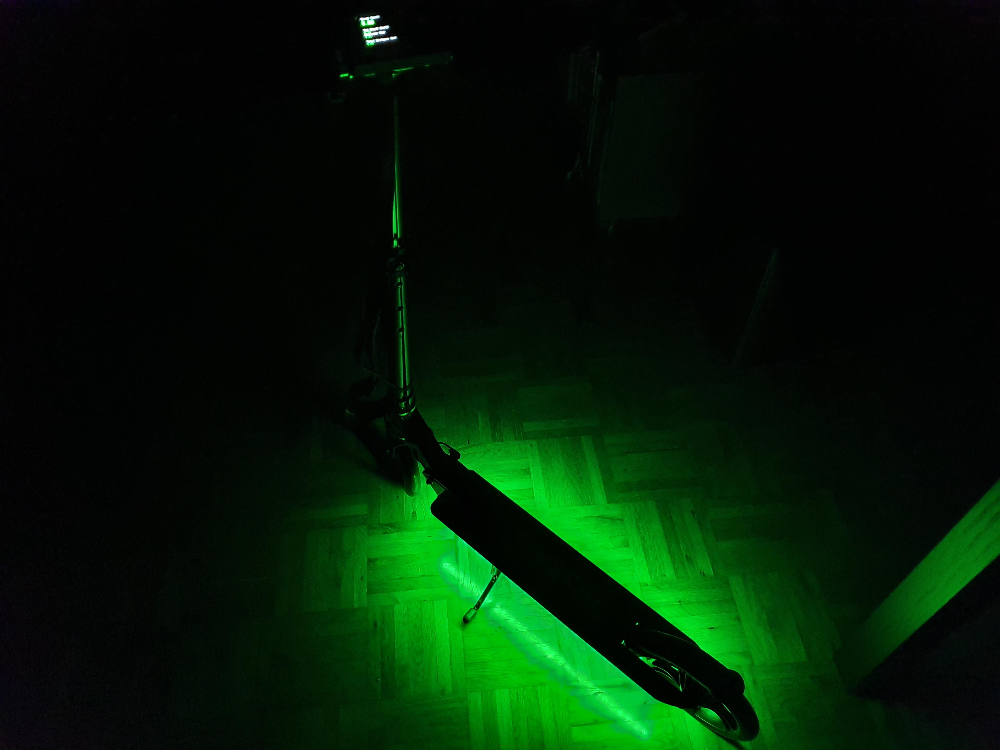

# c3scooter

A ridiculously over the top "pimp-my-ride" for my 36c3 scooter.



## Contents

  * `assets` - Images and such
  * `src` - MicroPython firmware, flash with e.g. `mpfshell`
  * `stls` - printables

## Hardware

  * [WeSkate Scooter](https://www.amazon.de/gp/product/B07SS7GXDT/) ([Affiliate Link](https://amzn.to/2PQr7il))
  * ["Wemos" Mini D1 ESP32](https://www.aliexpress.com/item/32834982479.html) (but any ESP32 or MicroPython based board should work just fine)
  * WS2812 LED strip, 5V, 60 Leds/m, optionally black PCB & IP67
  * [Waveshare 1.5" 128x128px RGB OLED module](https://www.aliexpress.com/item/32878557203.html)
  * [KY-040 rotary encoder module](https://www.amazon.de/gp/product/B07CMSHWV6/) ([Affiliate Link](https://amzn.to/2ScIAmC))
  * [Reedswitch, plastic housing](https://www.amazon.de/gp/product/B07SZDGXLC/) ([Affiliate Link](https://amzn.to/35ZC6eE))
  * Neodymium disc magnet, e.g. 8x3
  * [RAVPower 5000mAh power bank](https://www.amazon.de/gp/product/B07KSWHV45/) ([Affiliate Link](https://amzn.to/34LeKbp))
  * velcro, cable ties, duct tape and similar...

## Firmware

  * Copy files over using `mpfshell`. Precompile everything but `main.py` to `mpf`.

## Dev Environment

```
python3 -m virtualenv -p python3.6 venv
source venv/bin/activate
pip install -r requirements.txt
ln -s venv/lib/python3.6/site-packages/mpy_cross/mpy-cross venv/bin/mpy-cross
```

To compile jpg/png images to SSD1351 compatible `raw`, use [`img2rgb565.py`](https://github.com/rdagger/micropython-ssd1351/blob/master/utils/img2rgb565.py):

``` python
# -*- coding: utf-8 -*-
"""Utility to convert images to raw RGB565 format."""

from PIL import Image
from struct import pack
from os import path
import sys


def error(msg):
    """Display error and exit."""
    print (msg)
    sys.exit(-1)


def write_bin(f, pixel_list):
    """Save image in RGB565 format."""
    for pix in pixel_list:
        r = (pix[0] >> 3) & 0x1F
        g = (pix[1] >> 2) & 0x3F
        b = (pix[2] >> 3) & 0x1F
        f.write(pack('>H', (r << 11) + (g << 5) + b))


if __name__ == '__main__':
    args = sys.argv
    if len(args) != 2:
        error('Please specify input file: ./img2rgb565.py test.png')
    in_path = args[1]
    if not path.exists(in_path):
        error('File Not Found: ' + in_path)

    filename, ext = path.splitext(in_path)
    out_path = filename + '.raw'
    img = Image.open(in_path).convert('RGB')
    pixels = list(img.getdata())
    with open(out_path, 'wb') as f:
        write_bin(f, pixels)
    print('Saved: ' + out_path)
```

(Licensed by @rdagger under MIT)

## TODO / ideas

  * [ ] Another LED strip up the steering column?
  * [ ] RTC?
  * [ ] CSV data logging?
  * [ ] Sound & bass reactive (MSGEQ7)
  * [ ] 6-dof sensor & acceleration logging
  * [ ] electronic horn (mp3 board + speaker)
